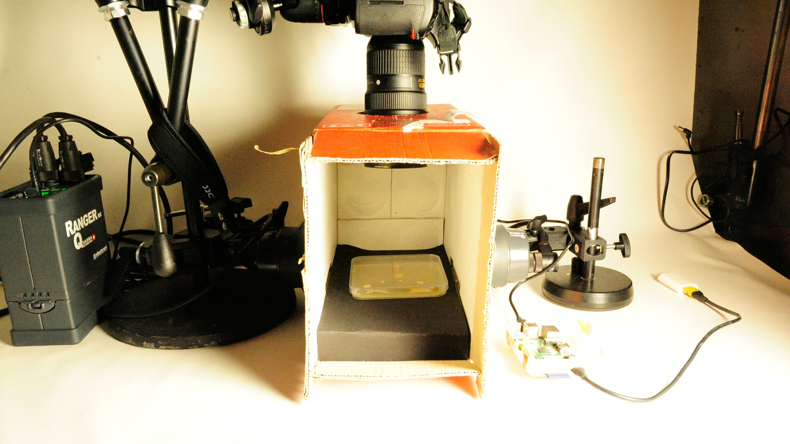

# README project_slimeMold_Schleimer

### Time Laps Record
For this project we needed a time laps video of a growing slime mold. On the photos below you can see the setup for the photos, inside the box is a petri dish breeding ground and the slime mold. The Camera was controlled with a raspberry pi and made a photo every 2 minutes. I used this [workaround](https://github.com/topada/DSLR-Timelapse-gphoto-RPI) by Jonas Köpfer.
I used Adobe Premiere to made a video out of the photos.

### Prerequisite

For Running the Script you will need:

+ [Processing 2.2.1](https://processing.org/download/) or later version
+ [OpenCV Libary for Processing ](https://github.com/atduskgreg/opencv-processing/releases)

### Usage

1. Copy the 'slime mold script' Folder to your Processing Sketchbook folder
2. The videoclip '[slime mold final mix hd.mpg](https://vimeo.com/137484436)' has to be in the subfolder 'data'
3. Open Processing and load the 'slime_mold_script.pyde'
4. Hit the 'Run' button
5. When finished a screenshot will be created and saved in the project folder.

### The Result

### Related Works

As Basis and inspiration for writing this script I used the [BackgroundSubtraction](https://github.com/jorditost/opencv-processing/tree/master/examples/BackgroundSubtraction) example by
Jordi Tost.

### Contact

If you want to contact me, write me an email at barockjunge@gmail.com.

### Licence
 The MIT License (MIT)

Copyright (c) [2015] [Lukas Schmidt-Wiegand]

Permission is hereby granted, free of charge, to any person obtaining a copy
of this software and associated documentation files (the "Software"), to deal
in the Software without restriction, including without limitation the rights
to use, copy, modify, merge, publish, distribute, sublicense, and/or sell
copies of the Software, and to permit persons to whom the Software is
furnished to do so, subject to the following conditions:

The above copyright notice and this permission notice shall be included in all
copies or substantial portions of the Software.

THE SOFTWARE IS PROVIDED "AS IS", WITHOUT WARRANTY OF ANY KIND, EXPRESS OR
IMPLIED, INCLUDING BUT NOT LIMITED TO THE WARRANTIES OF MERCHANTABILITY,
FITNESS FOR A PARTICULAR PURPOSE AND NONINFRINGEMENT. IN NO EVENT SHALL THE
AUTHORS OR COPYRIGHT HOLDERS BE LIABLE FOR ANY CLAIM, DAMAGES OR OTHER
LIABILITY, WHETHER IN AN ACTION OF CONTRACT, TORT OR OTHERWISE, ARISING FROM,
OUT OF OR IN CONNECTION WITH THE SOFTWARE OR THE USE OR OTHER DEALINGS IN THE
SOFTWARE.